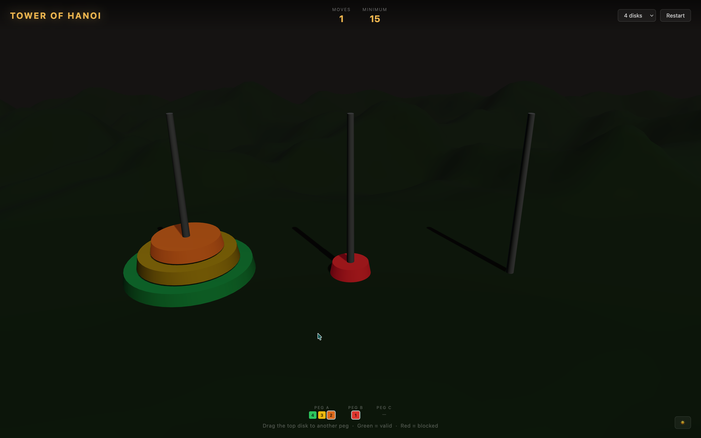

# Tower of Hanoi

A 3D Tower of Hanoi puzzle built with [Three.js](https://threejs.org/) and [Vite](https://vitejs.dev/). Drag the top disk to another peg — green ring means a valid move, red means blocked.



## Features

- Drag-and-drop with snap-to-peg
- 3 to 7 disks
- Move counter + optimal-move target
- Auto day/night theme based on local time (with manual toggle)
- Debug stack readout at the bottom

## Run locally

```bash
npm install
npm run dev
```

Then open the URL Vite prints (usually http://localhost:5173).

## Build

```bash
npm run build
```
